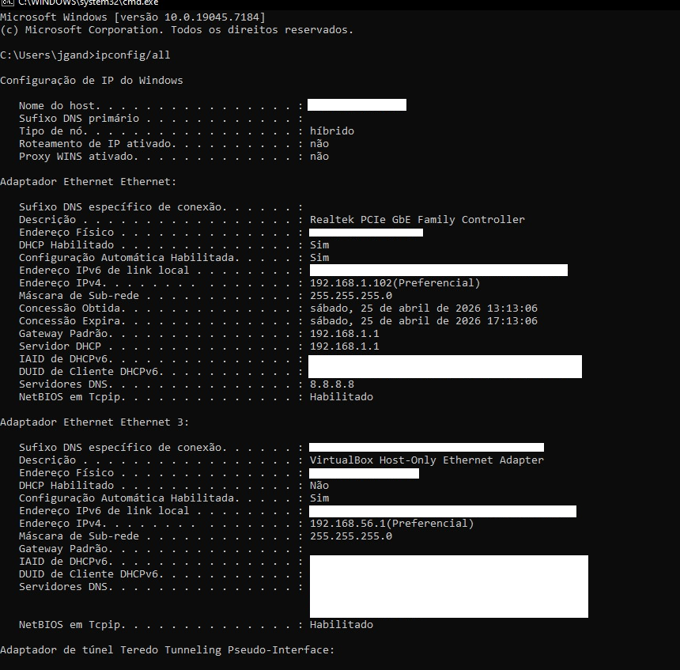
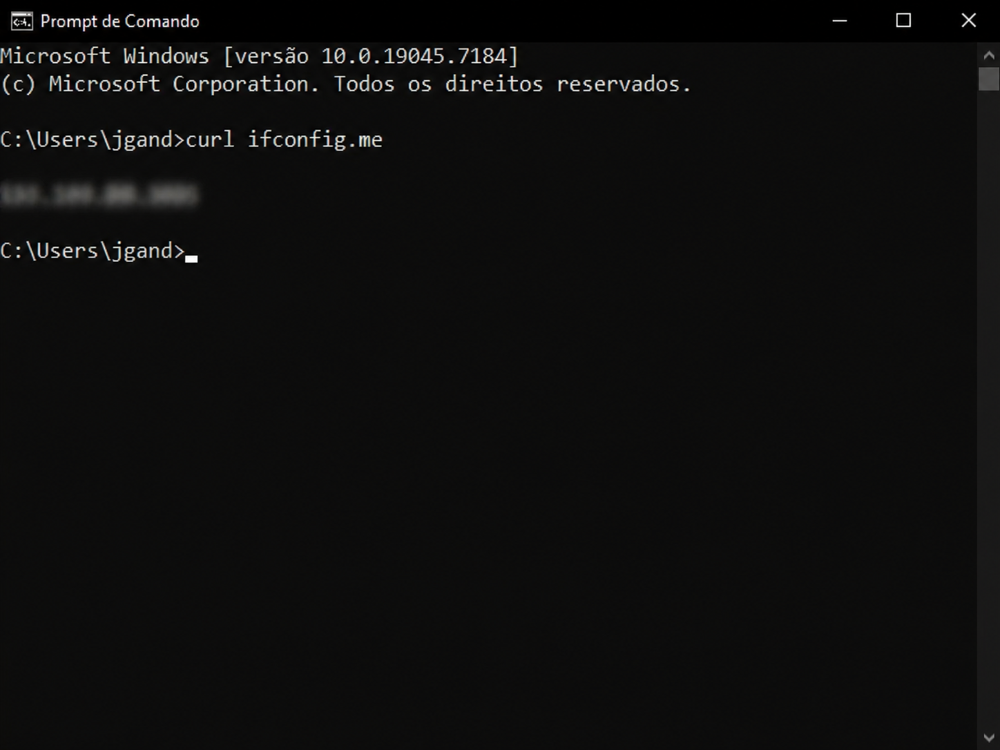

# Diagnóstico de Rede – Double NAT

## Visão Geral

Este projeto documenta o processo de diagnóstico de um problema de rede envolvendo double NAT (Network Address Translation duplo), identificado em um ambiente doméstico com múltiplos dispositivos de rede.

O objetivo foi analisar a origem do problema, validar hipóteses técnicas e compreender os impactos dessa configuração no funcionamento da rede.

Todos os dados sensíveis foram anonimizados para preservar a segurança do ambiente.

---

## Ambiente

* Rede doméstica com múltiplos dispositivos de roteamento
* Provedor de internet (<ISP_PROVIDER>)
* Sistema operacional com ferramentas de diagnóstico de rede

---

## Problema Identificado

Durante a análise da rede, foi observado comportamento inconsistente em aplicações que dependem de conectividade externa, como:

* dificuldade na abertura de portas
* falhas em conexões P2P
* instabilidade em serviços que requerem acesso direto

A investigação indicou a presença de double NAT, caracterizado pela existência de dois dispositivos realizando tradução de endereços na mesma rede.

---

## Metodologia

O diagnóstico seguiu as seguintes etapas:

1. Identificação do endereço IP local
2. Verificação do gateway padrão
3. Identificação do IP público
4. Comparação entre os valores
5. Análise da topologia da rede
6. Validação da hipótese de CGNAT

---

## Coleta de Informações

### Identificação de IP local e gateway

```bash
ip a
ip route
```

Esses comandos permitem identificar:

* endereço IP da máquina na rede local
* gateway padrão da rede

---

### Verificação do IP público

```bash
curl ifconfig.me
```

Objetivo:

* identificar o IP público visível externamente
* comparar com o IP configurado no roteador

---

## Evidências

### IP interno (máquina local)

Resultado do comando:

```bash
ipconfig /all
```


---

### IP externo (internet)

Resultado do comando:

```bash
curl ifconfig.me
```


---

## Validação

As evidências acima demonstram:

* o endereço IP interno da máquina dentro da rede local
* o endereço IP público visível externamente

A diferença entre esses valores confirma que o tráfego está passando por múltiplas camadas de NAT.

---

## Comparação de IPs

Com base nas evidências coletadas:

IP interno (gateway):
<PRIVATE_IP>

IP público identificado:
<PUBLIC_IP>

A divergência entre esses valores indica a presença de uma camada adicional de NAT.

---

## Processo de Raciocínio

A análise seguiu a seguinte lógica:

1. Identificação do IP local e gateway
2. Verificação do IP público externo
3. Comparação entre os valores
4. Identificação de inconsistência
5. Levantamento da hipótese de NAT adicional
6. Validação com base na arquitetura de rede do provedor

Esse processo permitiu concluir que o problema não estava na configuração local da rede.

---

## Análise Técnica

A presença de double NAT foi confirmada a partir dos seguintes indícios:

* divergência entre IP interno e IP público
* ausência de controle direto sobre o roteamento externo
* falha em configurações de port forwarding

Esse cenário é comumente associado a CGNAT, onde o provedor utiliza NAT em larga escala para compartilhar endereços IPv4 entre múltiplos usuários.

---

## Impacto

A configuração de double NAT afeta diretamente:

* serviços que requerem conexões de entrada
* aplicações P2P
* servidores locais
* acesso remoto à rede

Além disso, dificulta a implementação de regras de encaminhamento de portas (port forwarding), tornando a rede limitada para determinados usos.

---

## Implicações de Segurança

### Aspectos positivos

* reduz exposição direta da rede interna
* adiciona uma camada adicional de barreira contra acessos externos

### Aspectos negativos

* dificulta auditoria e monitoramento da rede
* mascara problemas reais de conectividade
* pode induzir a configurações incorretas de segurança

---

## Tentativas de Solução

Foram realizadas tentativas de:

* configuração de port forwarding
* ajuste de parâmetros do roteador

Sem sucesso, o que reforça a hipótese de limitação externa (CGNAT).

---

## Possíveis Soluções

As alternativas para mitigar o problema incluem:

* solicitação de IP público ao provedor
* utilização de modo bridge no modem (quando disponível)
* uso de VPN com suporte a encaminhamento de portas
* implementação de serviços intermediários (reverse proxy, túnel seguro)

A escolha da solução depende das restrições impostas pelo provedor e do nível de controle disponível sobre a rede.

---

## Resultado do Diagnóstico

O problema foi corretamente identificado como uma limitação externa relacionada à arquitetura do provedor (CGNAT).

Dessa forma, não é possível resolver completamente o cenário apenas com alterações locais na rede.

A resolução definitiva depende de ações como:

* obtenção de IP público junto ao provedor
* alteração do modo de operação do equipamento (bridge)
* uso de soluções intermediárias (VPN ou túnel)

Este diagnóstico evita tentativas incorretas de solução e direciona a abordagem para medidas compatíveis com o cenário real.

---

## Conclusão Técnica

A análise demonstra que o problema não está relacionado à configuração local da rede, mas sim à arquitetura imposta pelo provedor de internet.

Esse cenário é comum em ambientes residenciais modernos devido à escassez de endereços IPv4.

---

## Lições Aprendidas

* a análise de rede deve considerar a infraestrutura externa, não apenas o ambiente local
* divergências entre IPs são indicativos importantes de problemas estruturais
* nem todos os problemas de conectividade podem ser resolvidos apenas com configuração local
* a validação de hipóteses é essencial para um diagnóstico preciso

---

## Observação

Todos os dados de rede, incluindo endereços IP e informações de infraestrutura, foram anonimizados com o objetivo de evitar exposição de informações sensíveis.
